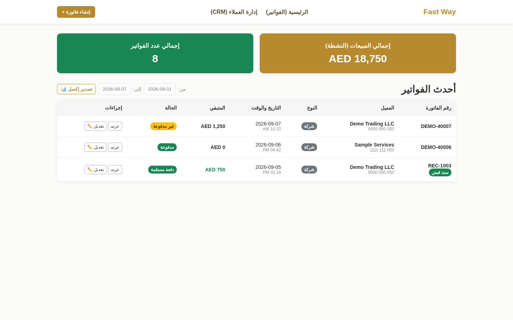
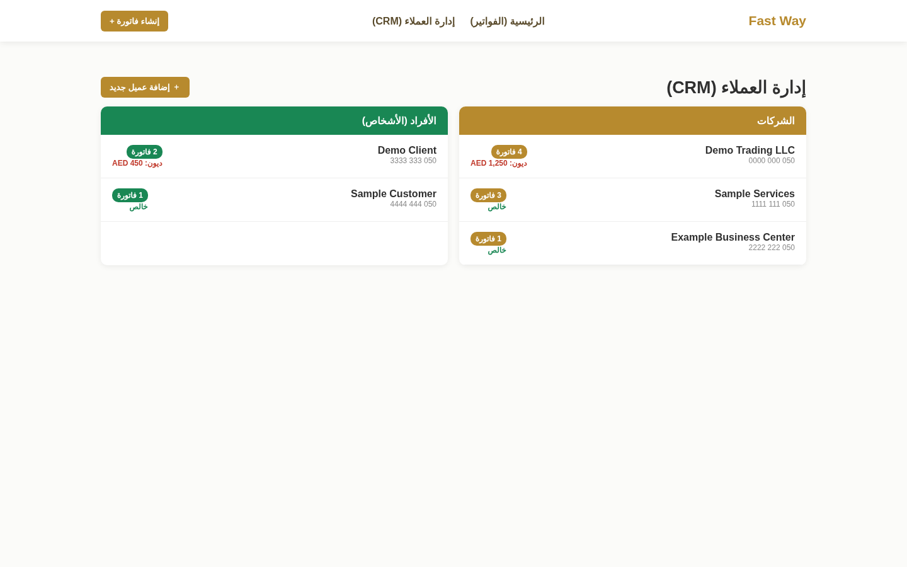
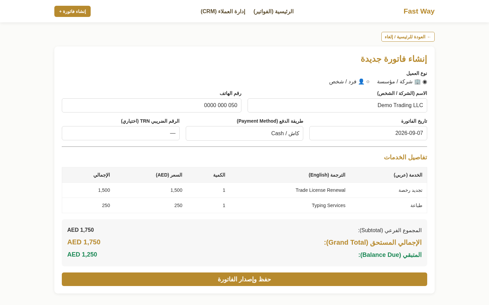

# Invoice & Operations Management System

> A private internal business application for invoice generation, customer management, financial tracking, and day-to-day operational workflows.

## Product Preview

### Operations Dashboard
A central view for active sales, invoice volume, balances, status tracking, date-based reporting, and common invoice actions.



### Customer Management (CRM)
Customer and company records are organized with invoice counts and outstanding balances to make account follow-up easier.



### Client Account Workflow
The client profile brings together outstanding balance, invoice history, payment receipts, status changes, duplication/editing actions, and statement generation in one operational view.


### Invoice Creation Workflow
The invoice workflow supports customer details, payment methods, VAT, discounts, paid amounts, bilingual service descriptions, and live totals.



> **Privacy note:** All public previews use sanitized demonstration data. Real customer records, company data, signatures, stamps, credentials, and production database contents are not published.

## Overview
The system supports practical day-to-day business operations around customer records, invoice creation, calculations, archiving, payments, printable statements, reporting, and workflow assistance.

## Key Capabilities
- Customer and company management
- Invoice generation, editing, duplication, and archiving
- Payment receipts and balance tracking
- Per-client invoice history and account follow-up
- VAT and discount calculations
- Printable customer-statement workflows
- Excel-based financial reporting
- Arabic/English translation-assisted service entry
- Internal operational management

## Tech Stack
`Python` · `Flask` · `SQLite` · `HTML5` · `JavaScript` · `Bootstrap 5` · `openpyxl`

## Engineering Focus
The project emphasizes reliable business workflows, structured records, reporting, maintainable operations tooling, and practical internal usability. It was designed around real operational needs rather than as a standalone UI concept.

## Architecture Snapshot

```text
Browser UI
   │
   ▼
Flask Application
   │
   ├── Invoice & Payment Workflows
   ├── Customer / Company Records
   ├── Reporting & Statement Generation
   └── SQLite Persistence
```

The public architecture intentionally stays high-level and excludes private deployment details, real business records, credentials, signatures, stamps, and other sensitive assets.

## Project Status
**Private internal system · Portfolio showcase**

The application shown here is a curated public presentation. The working source repository remains private and protected.

## Source Policy
**Portfolio showcase only. The production/full source repository is private and protected. Source code, business data, credentials, internal assets, and sensitive implementation details are intentionally not published.**

## Rights
© Karam Alawaj. All rights reserved. No license is granted to copy, redistribute, reuse, or republish proprietary source or implementation details.
